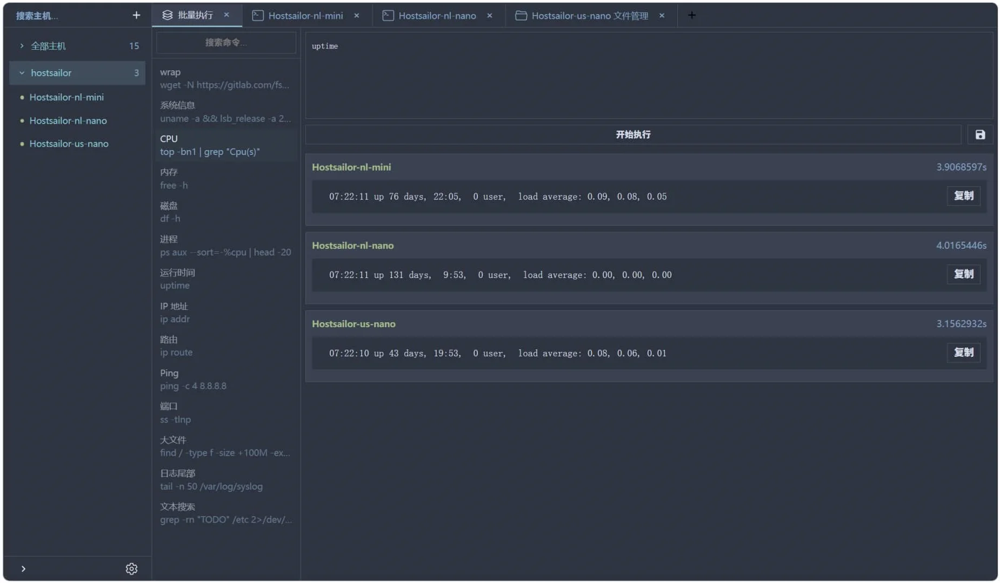
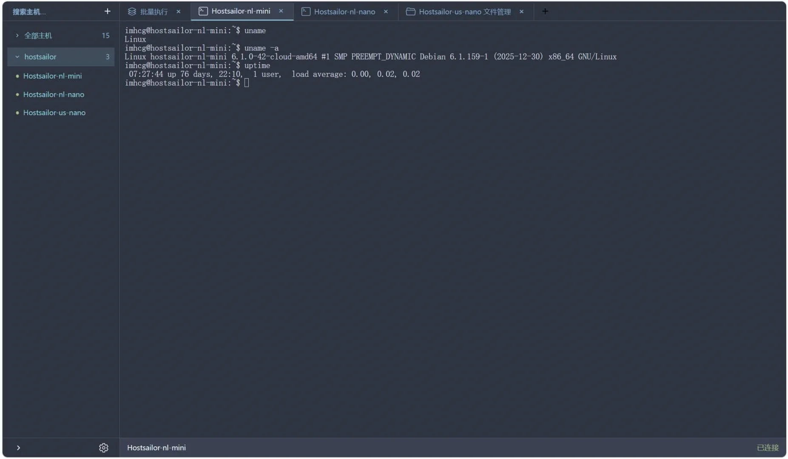
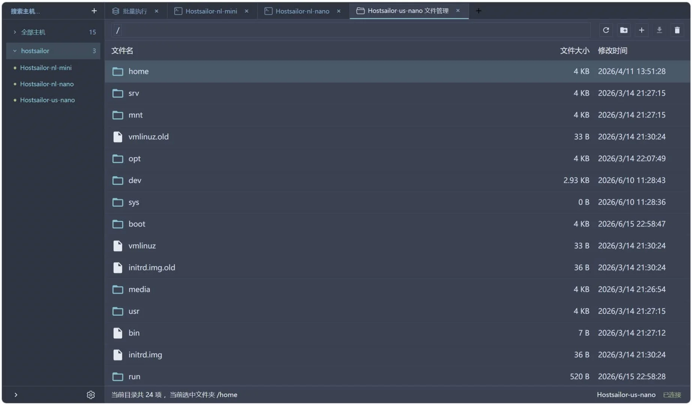

# Managi v3

轻量级的 Web 端 SSH 管理工具，支持终端会话、SFTP 文件传输、批量命令执行。

## 预览





## 特性

- **SSH 终端**：基于 xterm.js 的 Web 终端，支持多会话、窗口大小调整、断线重连恢复会话
- **SFTP 文件管理**：浏览、上传（断点续传）、下载（Range 请求）、删除
- **批量命令**：跨多节点并行执行命令，实时查看输出
- **多平台**：后端 Go 静态二进制（Linux/macOS/Windows, glibc/musl），前端单 HTML 文件，桌面端为 Go 托盘启动器

## 快速开始

### 跳板机方式（部署到服务器）

```bash
curl -fsSL -o ./install.sh https://github.com/hochenggang/managi-v3/releases/latest/download/install.sh
chmod +x ./install.sh
sudo ./install.sh
```

根据交互式提示进行安装，安装完成后，访问 `http://<服务器IP>:18001`。

支持的系统：Alpine、Debian、Ubuntu（amd64/arm64）。

安装脚本会按 Release 附带的 `<asset>.sha256` 自动校验下载产物；也可以自己指定预期指纹（注意 `sudo` 需要 `-E` 才保留环境变量）：

```bash
MANAGI_SHA256=<二进制文件的 sha256> sudo -E ./install.sh
```

### 客户端方式（本地桌面应用）

[下载 Windows 客户端](https://github.com/hochenggang/managi-v3/releases/latest/download/managi-desktop-windows-amd64.exe)（约 9MB，内嵌服务、前端与托盘）

双击后自动在 `http://127.0.0.1:18001` 启动服务并打开浏览器；端口被占用时自动顺延，失败原因显示在托盘图标上。

它与服务器形态是同一个二进制（`managi`），桌面版只是带 `-tray` 启动。


## 配置

后端只开放下面 5 个环境变量，配置文件 `/etc/managi/config.env` 首次安装时自动生成：

| 变量 | 默认值 | 说明 |
|------|--------|------|
| `MANAGI_HOST` | `0.0.0.0` | 监听地址 |
| `MANAGI_PORT` | `18001` | 监听端口 |
| `MANAGI_AUTH` | 空 | Basic Auth 凭据，格式 `user:pass`。**非空即启用鉴权**（凭据本身就是开关，没有单独的启用项）；留空则不鉴权。只按第一个冒号切分，密码里可以带冒号 |
| `MANAGI_INDEX_HTML` | `index.html` | 前端单页文件路径 |
| `MANAGI_KNOWN_HOSTS` | 空 | 指向 OpenSSH `known_hosts` 即启用严格主机密钥校验；留空沿用首次信任（TOFU）。文件无法解析时拒绝所有连接，不会退回 TOFU |

另有 `-host` / `-port` 命令行参数，显式传入时优先于同名环境变量（供手工运行调试）。

超时、心跳、连接池容量与分片大小属于协议调优参数而非用户选项：改错的代价是周期性掉线或单帧放大打爆内存，因此不再开放配置，统一取 `backend/internal/config` 里的默认值。客户端 IP 一律取真实连接地址，不采信 `X-Forwarded-For`（任何人都能伪造该头，采信后登录失败限流形同虚设）。

## 行为说明

### 终端会话复用

后端维护到目标服务器的 shell 会话，前端断开后保留 60 秒（固定值）。期间前端重连可复用同一会话（保留工作目录、运行中进程、scrollback）。超时后会话关闭。

### SFTP 下载路径

小文件（≤100MB）通过 WebSocket 下载；更大的文件自动切换为 HTTP Range 流式下载（`POST /api/sftp/download`），在支持的浏览器里直接写入磁盘选定的文件（File System Access API），不支持时退化为内存缓冲后触发保存，避免内存溢出。断点续传通过 Range 请求头实现。

### 主机密钥校验（TOFU）

首次连接某主机时记录其公钥（Trust On First Use），后续连接比对公钥，不匹配则拒绝（防中间人攻击）。主机密钥仅进程内有效，重启后重新信任。这是简约设计取舍：持久化主机密钥需引入额外存储与用户交互，当前场景（内网跳板机）可接受。

### 凭据存储

节点配置（含 SSH 密码/私钥）明文存储于浏览器 localStorage。这是工具定位（本机/内网管理端）的取舍：若需更高安全性，建议使用 SSH 密钥认证而非密码。

## 服务管理

```bash
# Debian/Ubuntu (systemd)
systemctl status managi
systemctl restart managi

# Alpine (OpenRC)
rc-service managi status
rc-service managi restart
```


## 技术栈

- **后端**：Go 1.25 + gorilla/websocket + golang.org/x/crypto/ssh
- **前端**：Vue 3 + TypeScript + Vite + xterm.js
- **桌面端**：Go system tray（单二进制内嵌服务与前端）
- **CI/CD**：GitHub Actions（自动构建、测试、发布）

## 开发

```bash
# 后端
cd backend && go test ./...

# 前端
cd frontend && npm ci && npm run dev

# Windows 桌面端（交叉编译，产物在 desktop/）
make build-desktop
```

## License

MIT
